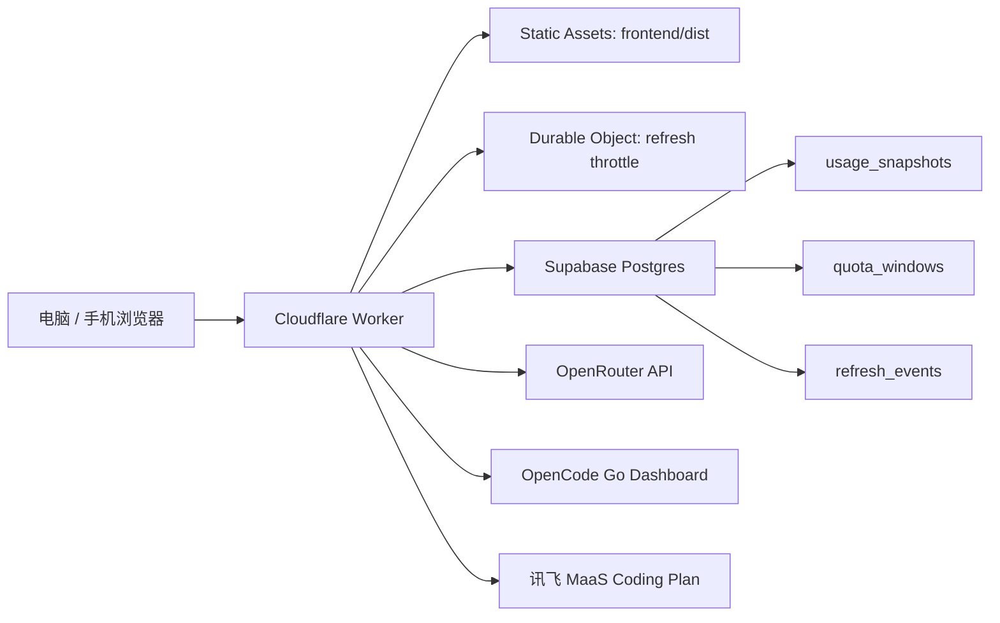

# ApiMonitor

API 与 Coding Plan 用量聚合看板。它把 OpenRouter、OpenCode Go、讯飞 MaaS Coding Plan 的用量状态聚合到一个响应式网页里，并用 Supabase 保存刷新快照。

线上示例：

[https://apimonitor.jarvislee90s.workers.dev](https://apimonitor.jarvislee90s.workers.dev)


## 功能亮点

- 统一展示 OpenRouter、OpenCode Go、讯飞 MaaS 三个平台状态。
- 支持 5 小时、每周、套餐总量等不同 quota window。
- 前端活跃时触发刷新，避免 cron 高频轮询。
- Cloudflare Durable Object 做刷新节流。
- Supabase Postgres 保存用量快照、窗口数据和刷新事件。
- Worker secrets 只保存在云端，不暴露到前端。
- OpenCode Go 支持“最近成功快照”回退，降低云端抓取不稳定时的页面空窗。

## 当前状态

| 模块 | 状态 |
| --- | --- |
| 前端看板 | 已部署到 Cloudflare Workers Static Assets |
| Worker API | 已部署到 Cloudflare Workers |
| Supabase 存储 | 已配置表、RLS、迁移 |
| OpenRouter | 已接入 |
| OpenCode Go | 已接入，含最近成功快照回退 |
| 讯飞 MaaS | 已接入 `coding-plan/list` 用量接口 |

## 架构



## 目录结构

```text
.
├── frontend/              # React + Vite 前端，Cloudflare 静态资源来源
│   ├── src/
│   ├── index.html
│   └── package.json
├── worker/                # Cloudflare Worker API 与 provider adapters
│   ├── providers/
│   ├── durable-object/
│   └── index.ts
├── supabase/migrations/   # Supabase 数据库迁移
├── tests/                 # 前端 hook、Worker、真实 e2e 测试
├── docs/                  # 计划、部署说明、README 图片资源
├── wrangler.toml          # Cloudflare Worker + Static Assets 配置
└── .env.example           # 本地环境变量模板
```

## 快速开始

安装依赖：

```powershell
npm install
```

复制环境变量模板：

```powershell
Copy-Item .env.example .env
```

本地开发前端：

```powershell
npm run dev
```

常规验证：

```powershell
npm run test
npm run build
```

真实端到端验证需要 `.env` 中配置真实 Supabase、OpenRouter、OpenCode Go 和讯飞 MaaS 登录态：

```powershell
$env:RUN_REAL_E2E="1"
npx vitest run tests/e2e/real-refresh.test.ts
```

## 部署

当前推荐部署方式是 Cloudflare Worker 同时托管 API 和前端静态资源。

部署前先构建前端：

```powershell
npm run build
```

上传 Worker secrets：

```powershell
npx wrangler@4 secret put SUPABASE_URL
npx wrangler@4 secret put SUPABASE_SERVICE_ROLE_KEY
npx wrangler@4 secret put SUPABASE_USER_ID
npx wrangler@4 secret put OPENROUTER_API_KEY
npx wrangler@4 secret put OPENCODE_GO_WORKSPACE_ID
npx wrangler@4 secret put OPENCODE_GO_AUTH_COOKIE
npx wrangler@4 secret put XFYUN_MAAS_API_URL
npx wrangler@4 secret put XFYUN_MAAS_AUTH_COOKIE
```

部署：

```powershell
npm run deploy:worker
```

`wrangler.toml` 中的关键配置：

```toml
[assets]
directory = "./frontend/dist"
not_found_handling = "single-page-application"
run_worker_first = ["/api/*"]
```

## 环境变量

不要提交 `.env`。公开仓库只保留 `.env.example`。

| 变量 | 用途 |
| --- | --- |
| `SUPABASE_URL` | Supabase 项目地址 |
| `SUPABASE_SERVICE_ROLE_KEY` | Worker 写入 Supabase 使用 |
| `SUPABASE_USER_ID` | 当前看板归属用户 |
| `OPENROUTER_API_KEY` | OpenRouter key endpoint |
| `OPENCODE_GO_WORKSPACE_ID` | OpenCode Go workspace id |
| `OPENCODE_GO_AUTH_COOKIE` | OpenCode Go 登录 cookie |
| `XFYUN_MAAS_API_URL` | 讯飞 `coding-plan/list` 用量接口 |
| `XFYUN_MAAS_AUTH_COOKIE` | 讯飞登录 cookie |
| `CLOUDFLARE_API_TOKEN` | 本地 Wrangler 部署使用 |

## 安全说明

- `.env`、cookie、service role key 不进入 Git。
- `output/`、`.wrangler/`、`node_modules/`、`frontend/dist/` 已被忽略。
- README 截图只展示用量，不包含密钥。
- 如果浏览器 DevTools 或日志中曾显示过第三方平台返回的应用凭据，建议在对应平台重置凭据。

## 开发命令

| 命令 | 说明 |
| --- | --- |
| `npm run dev` | 启动前端开发服务 |
| `npm run test` | 跑前端和 Worker 单元测试 |
| `npm run build` | 类型检查并构建前端 |
| `npm run deploy:worker` | 构建前端并部署 Worker + 静态资源 |
| `npm run test:worker` | 只跑 Worker 测试 |
| `npm run test:frontend` | 只跑前端测试 |

## 后续计划

- 模型级花费明细。
- 更稳定的 OpenCode Go 云端抓取策略。
- Cloudflare Browser Rendering 辅助登录态修复。
- 手机端交互细节优化。
- 用量预测和阈值告警。
