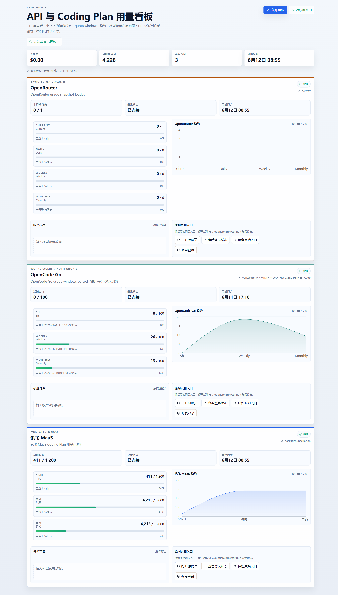
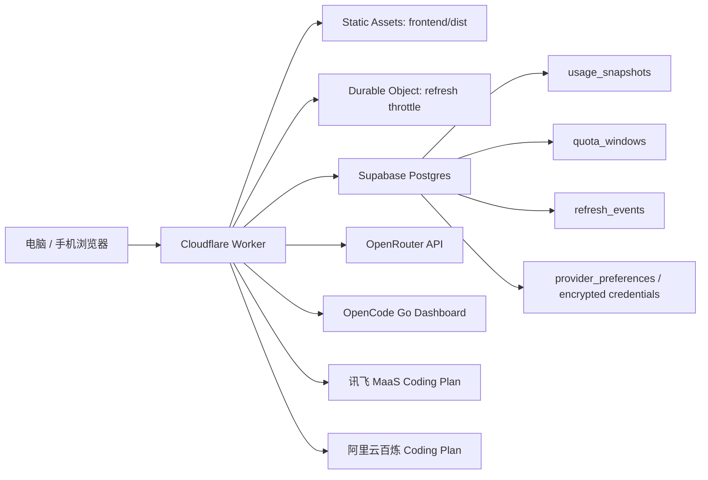

# ApiMonitor

[](LICENSE)

API 与 Coding Plan 用量聚合看板。它把 OpenRouter、OpenCode Go、讯飞 MaaS Coding Plan、阿里云百炼 Coding Plan、火山方舟 Coding Plan、智谱 BigModel Coding Plan 的用量状态聚合到一个响应式网页里，并用 Supabase 保存刷新快照和云端配置。

线上示例：

https://apimonitor.bondtoolbox.asia

自定义域名（国内可直连，不受 *.workers.dev SNI 阻断影响）：

https://apimonitor.bondtoolbox.asia



## 功能亮点

- 统一展示 OpenRouter、OpenCode Go、讯飞 MaaS、阿里云百炼、火山方舟、智谱 BigModel 六个平台状态。
- 支持 5 小时、每周、套餐总量等不同 quota window。
- 独立配置页支持"供应商 → 多账号 → 账号配置"的单页多层工作台。
- 首页保持一个供应商一个大卡片；多账号通过卡片内账号子卡片切换显示。
- 账号可单独控制是否在首页显示，停用不会删除配置或凭据。
- 前端活跃时最多每 2 分钟刷新一次；10 分钟无交互后停止自动刷新，避免 cron 高频轮询。
- Cloudflare Durable Object 做刷新节流。
- Supabase Postgres 保存用量快照、窗口数据和刷新事件。
- Supabase 保存配置，Worker 使用 AES-GCM 加密第三方凭据。
- OpenCode Go 支持双账号，分别登录在 Edge 不同 Profile，本地脚本串行刷新推送。
- OpenCode Go 支持“最近成功快照”回退，降低云端抓取不稳定时的页面空窗。

## 当前状态

| 模块 | 状态 |
| --- | --- |
| 前端看板 | 已部署到 Cloudflare Workers Static Assets |
| Worker API | 已部署到 Cloudflare Workers |
| Supabase 存储 | 已配置表、RLS、迁移 |
| OpenRouter | 已接入 |
| OpenCode Go | 已接入，含最近成功快照回退 |
| 讯飞 MaaS | 已接入 `coding-plan/list` 用量接口 |
| 阿里云百炼 | 已接入原网页入口；云端抓取保留为实验选项 |
| 火山方舟 | 已接入 `GetCodingPlanUsage` 用量接口（5小时/周/月百分比） |
| 智谱 BigModel | 已接入 `monitor/usage/quota/limit` + `credit-usage/usage-detail` 用量接口（5小时/周配额、Cache 命中率、积分） |
| 配置页 | 已接入 `#/settings` |

## 架构



## OpenCode Go 用量抓取机制

OpenCode Go 与其他供应商（讯飞 MaaS、OpenRouter）的抓取方式有本质区别，源于一个核心矛盾：**opencode.ai 屏蔽数据中心 IP**。Cloudflare Worker 的出口 IP 属于数据中心 IP，直连 opencode 用量页会被 302 重定向到登录页；而讯飞、OpenRouter 不屏蔽，Worker 云端能实时抓到。

### 数据通路对比

其他供应商走"云端直抓"，点首页同步即可实时刷新：

`mermaid
flowchart LR
    A1["前端点 同步"] --> A2["POST /api/refresh"]
    A2 --> A3["Worker 云端抓取<br/>数据中心 IP 直连"]
    A3 --> A4["成功 拿到实时数据"]
    A4 --> A5["落库 ready 快照"]
    A5 --> A6["看板展示实时值"]
`

OpenCode Go 走"本地脚本抓取 + 推送"，点同步无效（云端被封），只能靠本地脚本更新：

`mermaid
flowchart TB
    subgraph cloud["点同步（云端通路，对 opencode-go 无效）"]
        B1["前端点 同步"] --> B2["POST /api/refresh"]
        B2 --> B3["Worker 云端抓取<br/>fetchOpenCodeGoSnapshot"]
        B3 --> B4["数据中心 IP 被 opencode 封<br/>302 重定向到 login"]
        B4 --> B5["落库 login_required 快照<br/>windows 为空"]
        B5 --> B6["/api/usage 展示时 fallback<br/>到最近成功快照"]
        B6 --> B7["看板仍显示旧数据<br/>同步无效"]
    end

    subgraph local["本地脚本通路（唯一能更新数据的路径）"]
        L1["关闭所有浏览器"] --> L2["本地脚本启动<br/>playwright 开 Edge"]
        L2 --> L3["从浏览器 Profile<br/>提取 auth cookie"]
        L3 --> L4["本地国内 IP 直抓<br/>opencode 用量页"]
        L4 --> L5["成功 200"]
        L5 --> L6["parseOpenCodeGoWindows<br/>解析 3 个窗口"]
        L6 --> L7["POST /api/ingest/opencode-go<br/>X-Ingest-Key 鉴权"]
        L7 --> L8["ingest handler 校验<br/>persistSnapshot 落库"]
        L8 --> L9["新的 ready 快照<br/>fetchMethod=local_ingest"]
        L9 --> L10["看板下次加载<br/>展示新快照"]
    end

    B7 -. "数据来源其实是本地脚本推送" .-> L9
`

### 供应商对比

| 供应商 | 数据来源 | 点同步 | 刷新方式 |
| --- | --- | --- | --- |
| 讯飞 MaaS / OpenRouter | Worker 云端直抓 | ✅ 实时刷新 | 前端点同步 |
| OpenCode Go | 本地脚本抓取 + 推送 | ❌ 无效（云端 IP 被封） | 手动跑 `refresh-opencode-usage.ts` |
| 智谱 BigModel | Worker 云端直抓（持久化 cookie/token） | ✅ 实时刷新 | 本地脚本刷新 cookie 后点同步 |

### 注意事项

- **点同步刷不了 OpenCode Go 是架构限制，不是 bug**：opencode.ai 屏蔽数据中心 IP，Worker 云端抓取必然被 302 到登录页；看板展示时 `applyFallback` 会回退到最近一次成功的 `ready` 快照（即本地脚本上次推送的），所以无论点多少次同步，数据都不会变新。
- **自定义域名只解决网络封锁，不解决 IP 封锁**：*.workers.dev 在国内受 DNS 污染 + SNI 阻断，绑定 `apimonitor.bondtoolbox.asia` 后前端看板与本地脚本推送均可国内直连；但 Worker 出口 IP 仍是数据中心 IP，opencode 照样封，点同步仍无效。
- **本地脚本依赖浏览器登录态**：需先在 Edge 的 Default 和 Profile 1 中分别登录两个 opencode.ai 账号，运行前关闭所有 Edge 窗口（含后台进程）避免 Profile 锁定。
- **cookie 过期后需重新登录浏览器**：脚本从浏览器 Profile 提取 `auth cookie`，cookie 过期则抓取会被重定向到登录页。

### 刷新 Cookie 与用量（本地脚本）

部分供应商的登录态 cookie 会过期，或其用量页屏蔽数据中心 IP，需要本地脚本辅助刷新。火山/OpenCode 脚本复用本地浏览器 Profile 提取登录态，运行前需关闭对应浏览器（含后台进程）避免 Profile 锁定；DeepSeek/智谱脚本用账号密码在临时浏览器登录。`.env` 中需配置 `CLOUDFLARE_API_TOKEN`。

#### 智谱 BigModel Cookie 刷新

智谱登录态 token 约 7 天过期，过期后看板会显示 `login_required`。用账号密码登录并刷新 cookie：

```powershell
node --experimental-strip-types scripts/refresh-zhipu-cookie.ts
```

脚本读取 `.env` 中的 `Zai_account` / `Zai_password` 打开可见浏览器登录 `open.bigmodel.cn`，提取 `bigmodel_token_production` 与 `acw_tc` / `ssxmod_itna` 等 WAF cookie，调 `/monitor/usage/quota/limit` 验证后，写入 Supabase（provider_key=`zhipu`、label=`默认账号`，AES-GCM 加密 `{authCookie, authToken}`），并同步更新本地 `.env` 的 `ZHIPU_AUTH_COOKIE` / `ZHIPU_AUTH_TOKEN` 与 Cloudflare Worker 的 `ZHIPU_AUTH_COOKIE` secret。若遇腾讯点选验证码（点击图中文字，非滑块），脚本会提示并在浏览器中等待人工完成（最长 180 秒），不自动绕过。

#### 火山方舟 Cookie 刷新

火山方舟登录态 cookie 过期后，看板会显示 `login_required`。运行：

```powershell
node --experimental-strip-types scripts/refresh-volc-ark-cookie.ts
```

脚本从浏览器提取 `csrfToken` / `digest` / `AccountID` / `userInfo` 四个 cookie，调 `GetCodingPlanUsage` 验证有效性后，同时更新本地 `.env` 的 `VOLC_ARK_AUTH_COOKIE` 和 Cloudflare Worker 的同名 secret。若本地浏览器 Profile 被占用，会自动回退到临时浏览器——在弹出窗口登录火山方舟即可，脚本自动继续。

#### OpenCode Go 用量刷新

opencode.ai 屏蔽数据中心 IP，Worker 云端点同步无效，需本地脚本抓取用量并推送：

```powershell
node --experimental-strip-types scripts/refresh-opencode-usage.ts
```

脚本从 .env 读取两个账号的 workspaceId（`OPENCODE_GO_WORKSPACE_ID` 和 `OPENCODE_GO_WORKSPACE2_ID`），分别从 Edge Profile 1 和 Default 提取 auth cookie、抓取各自用量页、解析 3 个窗口后推送到 Worker `/api/ingest/opencode-go` 端点。两个账号串行刷新，互不阻塞。推送目标为自定义域名，国内可直连。

> **注意**：Chrome 149+ 的 App-Bound Encryption (ABE) 会阻止 CDP 读取 cookie，两个账号都必须用 Edge 浏览器登录。

#### OpenCode Go Cookie 刷新

只更新 OpenCode Go 的 auth cookie（不抓用量），同步到 Cloudflare Worker 的 `OPENCODE_GO_AUTH_COOKIE` secret：

```powershell
node --experimental-strip-types scripts/refresh-opencode-cookie.ts
```

脚本提取 cookie 后会用 `OPENCODE_GO_WORKSPACE_ID` 验证有效性，再通过 Cloudflare API 更新 Worker secret。Worker 下次刷新即使用新 cookie。

## 目录结构

```text
.
├── frontend/              # React + Vite 前端，Cloudflare 静态资源来源
│   ├── src/
│   ├── index.html
│   └── package.json
├── worker/                # Cloudflare Worker API 与 provider adapters
│   ├── providers/
│   ├── durable-object/
│   └── index.ts
├── supabase/migrations/   # Supabase 数据库迁移
├── tests/                 # 前端 hook、Worker、真实 e2e 测试
├── docs/                  # 计划、部署说明、README 图片资源
├── wrangler.toml          # Cloudflare Worker + Static Assets 配置
└── .env.example           # 本地环境变量模板
```

## 快速开始

安装依赖：

```powershell
npm install
```

复制环境变量模板：

```powershell
Copy-Item .env.example .env
```

本地开发前端：

```powershell
npm run dev
```

常规验证：

```powershell
npm run test
npm run build
```

真实端到端验证需要 `.env` 中配置真实 Supabase、OpenRouter、OpenCode Go 和讯飞 MaaS 登录态：

```powershell
$env:RUN_REAL_E2E="1"
npx vitest run tests/e2e/real-refresh.test.ts
```

## 部署

当前推荐部署方式是 Cloudflare Worker 同时托管 API 和前端静态资源。

部署前先构建前端：

```powershell
npm run build
```

上传 Worker secrets：

```powershell
npx wrangler@4 secret put SUPABASE_URL
npx wrangler@4 secret put SUPABASE_SERVICE_ROLE_KEY
npx wrangler@4 secret put CREDENTIAL_ENCRYPTION_KEY
npx wrangler@4 secret put OPENROUTER_API_KEY
npx wrangler@4 secret put OPENCODE_GO_WORKSPACE_ID
npx wrangler@4 secret put OPENCODE_GO_AUTH_COOKIE
npx wrangler@4 secret put XFYUN_MAAS_API_URL
npx wrangler@4 secret put XFYUN_MAAS_AUTH_COOKIE
npx wrangler@4 secret put ALIYUN_BAILIAN_AUTH_COOKIE
npx wrangler@4 secret put ALIYUN_BAILIAN_SEC_TOKEN
npx wrangler@4 secret put VOLC_ARK_AUTH_COOKIE
```

部署：

```powershell
npm run deploy:worker
```

`wrangler.toml` 中的关键配置：

```toml
[assets]
directory = "./frontend/dist"
not_found_handling = "single-page-application"
# 不需要 run_worker_first：wrangler 4 默认行为是 assets 不匹配时自动 fallback 到 worker
```

## 环境变量

不要提交 `.env`。公开仓库只保留 `.env.example`。

| 变量 | 用途 |
| --- | --- |
| `SUPABASE_URL` | Supabase 项目地址 |
| `SUPABASE_SERVICE_ROLE_KEY` | Worker 写入 Supabase 使用 |
| `CREDENTIAL_ENCRYPTION_KEY` | 32 字节 AES-GCM 加密 key，用于云端账号凭据 |
| `OPENROUTER_API_KEY` | OpenRouter key endpoint |
| `OPENCODE_GO_WORKSPACE_ID` | OpenCode Go 账号1 workspace id |
| `OPENCODE_GO_WORKSPACE2_ID` | OpenCode Go 账号2 workspace id |
| `OPENCODE_GO_AUTH_COOKIE` | OpenCode Go 登录 cookie |
| `XFYUN_MAAS_API_URL` | 讯飞 `coding-plan/list` 用量接口 |
| `XFYUN_MAAS_AUTH_COOKIE` | 讯飞登录 cookie |
| `ALIYUN_BAILIAN_PAGE_URL` | 阿里云百炼 Coding Plan 看板入口 |
| `ALIYUN_BAILIAN_API_URL` | 可选，实验性云端抓取接口；默认不启用 |
| `ALIYUN_BAILIAN_AUTH_COOKIE` | 阿里云百炼登录 cookie，默认入口模式不主动使用 |
| `ALIYUN_BAILIAN_SEC_TOKEN` | 可选，实验性云端抓取需要的阿里云 token |
| `ALIYUN_BAILIAN_CLOUD_FETCH` | 可选，设为 `1` 才启用百炼云端抓取实验 |
| `VOLC_ARK_PAGE_URL` | 火山方舟 Coding Plan 订阅页入口 |
| `VOLC_ARK_API_URL` | 可选，留空则用默认 `GetCodingPlanUsage` 端点 |
| `VOLC_ARK_AUTH_COOKIE` | 火山方舟登录态 cookie（csrfToken / digest / AccountID / userInfo） |
| `ZHIPU_PAGE_URL` | 智谱 Coding Plan 用量页入口 |
| `ZHIPU_API_BASE` | 智谱用量接口前缀（默认 `https://bigmodel.cn/api`） |
| `ZHIPU_AUTH_COOKIE` | 智谱登录态 cookie（`bigmodel_token_production` + `acw_tc` 等 WAF cookie） |
| `ZHIPU_AUTH_TOKEN` | 智谱登录 token（即 `bigmodel_token_production` 的值） |
| `Zai_account` / `Zai_password` | 智谱登录脚本专用账号密码（不写入 Worker） |
| `CLOUDFLARE_API_TOKEN` | 本地 Wrangler 部署使用 |
| `INGEST_API_KEY` | 本地脚本推送 opencode 快照的共享密钥（Worker 端需配置同名 secret） |
| `APIMONITOR_INGEST_URL` | 本地脚本推送目标（Worker 线上地址，已配置为自定义域名） |

## 安全说明

- `.env`、cookie、service role key 不进入 Git。
- 配置页只把第三方凭据发给 Worker，Worker 加密后写入 Supabase `provider_account_credentials` 表；前端只读取脱敏 `credential_hint`。在新 schema migration 部署前的过渡期，账号级配置和凭据 JSONB 会以兼容模式存到 `provider_accounts.config`（未加密）；迁移完成后此兼容模式自动失效。
- 账号级停用只影响首页展示，不删除 Supabase 中的账号元数据和加密凭据。
- 阿里云百炼默认只保存原网页入口；实验性云端抓取字段默认不填写、不启用。
- `output/`、`.wrangler/`、`node_modules/`、`frontend/dist/` 已被忽略。
- README 截图只展示用量，不包含密钥。
- 如果浏览器 DevTools 或日志中曾显示过第三方平台返回的应用凭据，建议在对应平台重置凭据。

## 开发命令

| 命令 | 说明 |
| --- | --- |
| `npm run dev` | 启动前端开发服务 |
| `npm run test` | 跑前端和 Worker 单元测试 |
| `npm run build` | 类型检查并构建前端 |
| `npm run deploy:worker` | 构建前端并部署 Worker + 静态资源 |
| `npm run test:worker` | 只跑 Worker 测试 |
| `npm run test:frontend` | 只跑前端测试 |

## 致谢

本项目在架构和实现过程中参考了以下开源项目，致谢其作者：

- [all-api-hub](references/all-api-hub) — 账号卡片与原网页入口
- [codeburn](references/codeburn) — Provider adapter 抽象
- [onwatch](references/onwatch) — OpenRouter API 思路
- [one-api](references/one-api) — 余额与渠道健康模型
- [opencode-quota](references/opencode-quota) — OpenCode Go 用量窗口抓取思路

参考项目在 `references/` 目录下，仅供设计参考，**未将代码直接复制到正式实现**。

## 后续计划

- 模型级花费明细。
- 更稳定的 OpenCode Go 云端抓取策略。
- Cloudflare Browser Rendering 辅助登录态修复。
- 手机端交互细节优化。
- 用量预测和阈值告警。
