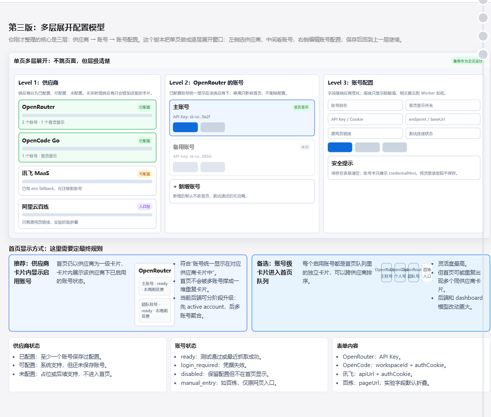

# 分层供应商账号配置页 Implementation Plan

> **For agentic workers:** REQUIRED SUB-SKILL: Use superpowers:subagent-driven-development (recommended) or superpowers:executing-plans to implement this plan task-by-task. Steps use checkbox (`- [ ]`) syntax for tracking.

**Goal:** 把配置页升级为“供应商 → 多账号 → 账号配置”的单页多层工作台，并让首页保持一个供应商一个大卡片、大卡片内通过账号子卡片切换显示不同账号数据。

**Architecture:** Supabase 继续保存供应商偏好、账号元数据和加密凭据；新增账号级首页显示字段，Worker 只抓取首页启用账号并把同一供应商的账号快照聚合到一个 dashboard card。前端设置页改为供应商卡片池、账号列表、账号配置三层展开；首页 `PlatformCard` 增加账号子卡片切换器，选中的账号决定大卡片主体显示内容。

**Tech Stack:** React, TypeScript, Vite, Cloudflare Worker, Supabase Postgres REST, Web Crypto AES-GCM, Vitest, Testing Library, Wrangler.

---

## Visual Reference

实现时必须参考这张已确认的多层展开配置模型，不要退回成普通左右两栏表单：



关键视觉结构：

- 顶部标题为“第三版：多层展开配置模型”，说明这是单页多层展开，不跳页面。
- 主体第一块是三列工作台：`Level 1: 供应商`、`Level 2: 当前供应商的账号`、`Level 3: 账号配置`。
- 供应商卡片体现状态：已配置、可配置、入口型。
- 账号层展示多个账号卡片：主账号、备用账号、新增账号。
- 配置层展示账号字段、首页显示开关、测试连接状态和安全提示。
- 首页显示方式区域必须保留“推荐：供应商卡片内显示启用账号”的设计方向。
- 底部保留三组规则说明：供应商状态、账号状态、表单内容。

## Scope Check

本计划只覆盖第二阶段 UI/UX 和数据流升级：

- 首页仍然是一个供应商一个大卡片。
- 每个供应商大卡片内部展示多个账号子卡片。
- 点选某个账号子卡片后，大卡片主体展示该账号的用量、窗口、状态、原网页入口。
- 设置页采用单页多层展开：供应商卡片池 → 账号列表 → 账号配置表单。
- 账号可启用或停用首页显示；停用不删除配置和凭据。
- 阿里云百炼默认仍为“原网页入口型 provider”，只需要 pageUrl；实验抓取字段折叠为高级区，不默认启用。

本计划不做网页登录自动化、不保存网页登录密码、不引入新的 UI 框架或拖拽库、不重写 Supabase Auth 鉴权模式。

## File Structure

- Create: `supabase/migrations/202606130001_provider_account_homepage_visibility.sql`  
  为 `provider_accounts` 增加账号级首页显示、排序和最近测试摘要字段。
- Modify: `worker/types.ts`  
  增加 dashboard account 子卡片类型，并扩展 `UsageProviderCard`。
- Modify: `worker/settings/repository.ts`  
  读写 `homepage_enabled`、`homepage_order`、`last_test_summary`；新增列出首页账号配置的函数。
- Modify: `worker/settings/routes.ts`  
  扩展保存账号 API；新增账号显示状态更新 API。
- Modify: `worker/index.ts`  
  refresh 时优先抓取首页启用账号；没有启用账号时使用当前 active account/env fallback。
- Modify: `worker/dashboard.ts`  
  把同一供应商的多个账号快照聚合成一个 provider card，card 内包含 `accounts`。
- Modify: `frontend/src/api/client.ts`  
  映射后端 `accounts` 字段；前端 `PlatformSnapshot` 增加账号子快照。
- Modify: `frontend/src/components/platform-card.tsx`  
  增加账号子卡片切换器；切换后大卡片主体显示选中账号数据。
- Modify: `frontend/src/settings/settings-page.tsx`  
  改为三层工作台容器：供应商池、账号层、配置层。
- Create: `frontend/src/settings/provider-gallery.tsx`  
  多排供应商卡片池，按已配置、可配置、入口型分组展示。
- Create: `frontend/src/settings/homepage-account-queue.tsx`  
  当前供应商内“首页显示账号”的可排序列表。
- Modify: `frontend/src/settings/provider-account-panel.tsx`  
  账号列表支持首页显示开关、设为默认显示、测试连接。
- Modify: `frontend/src/settings/credential-form.tsx`  
  provider-specific 字段、百炼高级实验区、保存后清空敏感输入。
- Modify: `frontend/src/styles.css`  
  设置页工作台布局、供应商卡片池、账号子卡片、移动端布局。
- Modify: `tests/worker/settings-routes.test.ts`
- Modify: `tests/worker/index.test.ts`
- Modify: `tests/worker/providers.test.ts`
- Modify: `tests/frontend/apiClient.test.ts`
- Modify: `tests/frontend/settingsPage.test.tsx`
- Create: `tests/frontend/platformCardAccounts.test.tsx`

---

### Task 1: Supabase 账号级首页显示模型

**Files:**
- Create: `supabase/migrations/202606130001_provider_account_homepage_visibility.sql`
- Modify: `tests/worker/settings-routes.test.ts`

- [ ] **Step 1: 写 migration 验收测试**

在 `tests/worker/settings-routes.test.ts` 增加：

```ts
import { readFileSync } from "node:fs";
import { describe, expect, it } from "vitest";

describe("provider account homepage visibility migration", () => {
  it("adds account-level homepage visibility without exposing credentials", () => {
    const sql = readFileSync(
      "supabase/migrations/202606130001_provider_account_homepage_visibility.sql",
      "utf8",
    );

    expect(sql).toContain("alter table public.provider_accounts");
    expect(sql).toContain("add column if not exists homepage_enabled boolean not null default false");
    expect(sql).toContain("add column if not exists homepage_order integer not null default 100");
    expect(sql).toContain("add column if not exists last_test_summary text");
    expect(sql).toContain("create index if not exists provider_accounts_homepage_order_idx");
    expect(sql).toContain("on public.provider_accounts (user_id, provider_key, homepage_enabled, homepage_order)");
    expect(sql).not.toContain("provider_account_credentials");
  });
});
```

- [ ] **Step 2: 运行测试确认失败**

Run: `npm run test:worker -- tests/worker/settings-routes.test.ts`

Expected: FAIL，提示找不到 `202606130001_provider_account_homepage_visibility.sql`。

- [ ] **Step 3: 新增 migration**

创建 `supabase/migrations/202606130001_provider_account_homepage_visibility.sql`：

```sql
alter table public.provider_accounts
  add column if not exists homepage_enabled boolean not null default false,
  add column if not exists homepage_order integer not null default 100,
  add column if not exists last_test_summary text;

create index if not exists provider_accounts_homepage_order_idx
  on public.provider_accounts (user_id, provider_key, homepage_enabled, homepage_order);
```

- [ ] **Step 4: 运行测试确认通过**

Run: `npm run test:worker -- tests/worker/settings-routes.test.ts`

Expected: PASS。

- [ ] **Step 5: 提交**

```powershell
git add supabase/migrations/202606130001_provider_account_homepage_visibility.sql tests/worker/settings-routes.test.ts
git commit -m "feat: add account homepage visibility schema"
```

---

### Task 2: Settings API 支持账号首页显示与排序

**Files:**
- Modify: `worker/settings/repository.ts`
- Modify: `worker/settings/routes.ts`
- Modify: `frontend/src/api/client.ts`
- Modify: `tests/worker/settings-routes.test.ts`
- Modify: `tests/frontend/apiClient.test.ts`

- [ ] **Step 1: 写 Worker API 失败测试**

在 `tests/worker/settings-routes.test.ts` 增加：

```ts
import { handleSettingsRequest } from "../../worker/settings/routes";

it("returns account homepage visibility in settings payload", async () => {
  const fetchImpl = vi.fn(async (url: string | URL | Request) => {
    if (String(url).includes("provider_preferences")) {
      return Response.json([{ provider_key: "openrouter", enabled: true, display_order: 1 }]);
    }

    if (String(url).includes("provider_accounts")) {
      return Response.json([
        {
          id: "acc-openrouter-main",
          provider_key: "openrouter",
          account_label: "主账号",
          source_url: "https://openrouter.ai/activity",
          status: "ready",
          status_message: null,
          credential_hint: { apiKey: "sk-or...abcd" },
          homepage_enabled: true,
          homepage_order: 1,
          last_test_summary: "OpenRouter usage snapshot loaded",
        },
      ]);
    }

    return Response.json([]);
  });

  const response = await handleSettingsRequest(
    new Request("https://app.test/api/settings/providers", {
      headers: { "x-api-monitor-admin-token": "local-admin" },
    }),
    {
      ADMIN_SETUP_TOKEN: "local-admin",
      SUPABASE_URL: "https://supabase.test",
      SUPABASE_SERVICE_ROLE_KEY: "service-role",
      SUPABASE_USER_ID: "00000000-0000-0000-0000-000000000001",
    } as never,
    fetchImpl as typeof fetch,
  );

  const payload = await response.json();
  expect(payload.data.accounts[0]).toMatchObject({
    id: "acc-openrouter-main",
    providerKey: "openrouter",
    accountLabel: "主账号",
    homepageEnabled: true,
    homepageOrder: 1,
    lastTestSummary: "OpenRouter usage snapshot loaded",
  });
});

it("updates account homepage visibility without touching credentials", async () => {
  const fetchImpl = vi.fn(async () => new Response(null, { status: 204 }));

  const response = await handleSettingsRequest(
    new Request("https://app.test/api/settings/accounts/acc-1/display", {
      method: "PATCH",
      headers: {
        "content-type": "application/json",
        "x-api-monitor-admin-token": "local-admin",
      },
      body: JSON.stringify({ homepageEnabled: true, homepageOrder: 2 }),
    }),
    {
      ADMIN_SETUP_TOKEN: "local-admin",
      SUPABASE_URL: "https://supabase.test",
      SUPABASE_SERVICE_ROLE_KEY: "service-role",
      SUPABASE_USER_ID: "00000000-0000-0000-0000-000000000001",
    } as never,
    fetchImpl as typeof fetch,
  );

  expect(response.status).toBe(200);
  expect(fetchImpl).toHaveBeenCalledWith(
    expect.objectContaining({ pathname: "/rest/v1/provider_accounts" }),
    expect.objectContaining({
      method: "PATCH",
      body: JSON.stringify({
        homepage_enabled: true,
        homepage_order: 2,
      }),
    }),
  );
});
```

- [ ] **Step 2: 运行测试确认失败**

Run: `npm run test:worker -- tests/worker/settings-routes.test.ts`

Expected: FAIL，`homepageEnabled` 字段不存在，`PATCH /display` 返回 404。

- [ ] **Step 3: 扩展 repository 类型和映射**

在 `worker/settings/repository.ts` 中修改类型：

```ts
export type SafeProviderAccount = {
  id: string;
  providerKey: string;
  accountLabel: string;
  sourceUrl: string;
  status: string;
  statusMessage: string | null;
  credentialHint: Record<string, unknown>;
  homepageEnabled: boolean;
  homepageOrder: number;
  lastTestSummary: string | null;
};

type ProviderAccountRow = {
  id?: string;
  provider_key?: string;
  account_label?: string;
  source_url?: string;
  status?: string;
  status_message?: string | null;
  credential_hint?: Record<string, unknown> | null;
  homepage_enabled?: boolean;
  homepage_order?: number;
  last_test_summary?: string | null;
};
```

把 `mapProviderAccount` 改为：

```ts
function mapProviderAccount(row: ProviderAccountRow): SafeProviderAccount | null {
  if (!row.id || !row.provider_key) return null;
  return {
    id: row.id,
    providerKey: row.provider_key,
    accountLabel: row.account_label ?? "",
    sourceUrl: row.source_url ?? "",
    status: row.status ?? "disabled",
    statusMessage: row.status_message ?? null,
    credentialHint: row.credential_hint ?? {},
    homepageEnabled: row.homepage_enabled ?? false,
    homepageOrder: row.homepage_order ?? 100,
    lastTestSummary: row.last_test_summary ?? null,
  };
}
```

把 `listProviderSettings` 的 accounts select 改为：

```ts
accountsUrl.searchParams.set(
  "select",
  "id,provider_key,account_label,source_url,status,status_message,credential_hint,homepage_enabled,homepage_order,last_test_summary",
);
```

- [ ] **Step 4: 新增账号显示状态更新函数**

在 `worker/settings/repository.ts` 增加：

```ts
export async function updateProviderAccountDisplay(
  env: SettingsEnv,
  accountId: string,
  display: { homepageEnabled: boolean; homepageOrder: number },
  fetchImpl: typeof fetch,
): Promise<{ id: string; homepageEnabled: boolean; homepageOrder: number }> {
  if (!env.SUPABASE_URL || !env.SUPABASE_SERVICE_ROLE_KEY || !env.SUPABASE_USER_ID) {
    throw new Error("Supabase configuration missing");
  }

  const url = new URL("/rest/v1/provider_accounts", env.SUPABASE_URL);
  url.searchParams.set("id", `eq.${accountId}`);
  url.searchParams.set("user_id", `eq.${env.SUPABASE_USER_ID}`);

  const response = await fetchImpl(url, {
    method: "PATCH",
    headers: {
      ...createSupabaseHeaders(env.SUPABASE_SERVICE_ROLE_KEY),
      Prefer: "return=minimal",
      "content-type": "application/json",
    },
    body: JSON.stringify({
      homepage_enabled: display.homepageEnabled,
      homepage_order: display.homepageOrder,
    }),
  });

  if (!response.ok) {
    throw new Error(`Failed to update account display: ${response.status}`);
  }

  return {
    id: accountId,
    homepageEnabled: display.homepageEnabled,
    homepageOrder: display.homepageOrder,
  };
}
```

- [ ] **Step 5: 接入 settings route**

在 `worker/settings/routes.ts` import 中加入：

```ts
import { updateProviderAccountDisplay } from "./repository";
```

在 `handleSettingsRequest` 中 `POST /api/settings/accounts` 分支后加入：

```ts
const displayMatch = url.pathname.match(/^\/api\/settings\/accounts\/([^/]+)\/display$/);
if (request.method === "PATCH" && displayMatch) {
  try {
    const accountId = decodeURIComponent(displayMatch[1]!);
    const body = await readJsonBody<{
      homepageEnabled: boolean;
      homepageOrder: number;
    }>(request);
    return successResponse(await updateProviderAccountDisplay(
      env,
      accountId,
      {
        homepageEnabled: body.homepageEnabled,
        homepageOrder: body.homepageOrder,
      },
      fetchImpl,
    ));
  } catch (error) {
    const message = error instanceof Error ? error.message : "Failed to update account display";
    return errorResponse(500, "account_display_update_failed", message);
  }
}
```

- [ ] **Step 6: 扩展前端 API 类型和 client**

在 `frontend/src/api/client.ts` 的 `SafeProviderAccount` 增加：

```ts
homepageEnabled: boolean;
homepageOrder: number;
lastTestSummary: string | null;
```

在 `createApiClient` 返回对象中增加：

```ts
async updateProviderAccountDisplay(
  adminToken: string,
  accountId: string,
  input: { homepageEnabled: boolean; homepageOrder: number },
): Promise<{ id: string; homepageEnabled: boolean; homepageOrder: number }> {
  const payload = await requestJson<
    { id: string; homepageEnabled: boolean; homepageOrder: number } |
    ApiEnvelope<{ id: string; homepageEnabled: boolean; homepageOrder: number }>
  >(
    fetcher,
    buildUrl(options.baseUrl, `/api/settings/accounts/${encodeURIComponent(accountId)}/display`),
    {
      method: "PATCH",
      credentials: "include",
      headers: {
        ...headers,
        "x-api-monitor-admin-token": adminToken,
      },
      body: JSON.stringify(input),
    },
  );

  return unwrapEnvelope(payload);
}
```

- [ ] **Step 7: 写前端 API 测试**

在 `tests/frontend/apiClient.test.ts` 增加：

```ts
it("updates provider account homepage display", async () => {
  const fetcher = vi.fn(async () =>
    Response.json({
      ok: true,
      data: { id: "acc-1", homepageEnabled: true, homepageOrder: 3 },
    }),
  );
  const api = createApiClient({ baseUrl: "https://app.test", fetcher: fetcher as typeof fetch });

  await expect(api.updateProviderAccountDisplay("admin-token", "acc-1", {
    homepageEnabled: true,
    homepageOrder: 3,
  })).resolves.toEqual({ id: "acc-1", homepageEnabled: true, homepageOrder: 3 });

  expect(fetcher).toHaveBeenCalledWith(
    "https://app.test/api/settings/accounts/acc-1/display",
    expect.objectContaining({
      method: "PATCH",
      body: JSON.stringify({ homepageEnabled: true, homepageOrder: 3 }),
    }),
  );
});
```

- [ ] **Step 8: 运行测试确认通过**

Run: `npm run test:worker -- tests/worker/settings-routes.test.ts`

Expected: PASS。

Run: `npm run test:frontend -- tests/frontend/apiClient.test.ts`

Expected: PASS。

- [ ] **Step 9: 提交**

```powershell
git add worker/settings frontend/src/api/client.ts tests/worker/settings-routes.test.ts tests/frontend/apiClient.test.ts
git commit -m "feat: expose account homepage display settings"
```

---

### Task 3: Worker Dashboard 聚合同供应商多账号

**Files:**
- Modify: `worker/types.ts`
- Modify: `worker/dashboard.ts`
- Modify: `worker/settings/repository.ts`
- Modify: `worker/index.ts`
- Modify: `tests/worker/index.test.ts`

- [ ] **Step 1: 写 dashboard 聚合失败测试**

在 `tests/worker/index.test.ts` 增加：

```ts
import { buildUsageDashboard } from "../../worker/dashboard";

it("keeps one provider card and nests account snapshots", () => {
  const dashboard = buildUsageDashboard([
    createSnapshot({
      ...openrouterSnapshot,
      summary: "主账号 loaded",
      meta: { accountId: "acc-main", accountLabel: "主账号" },
      windows: [{ key: "month", label: "Monthly", used: 10, limit: 100, remaining: 90 }],
    }),
    createSnapshot({
      ...openrouterSnapshot,
      summary: "备用账号 loaded",
      meta: { accountId: "acc-backup", accountLabel: "备用账号" },
      windows: [{ key: "month", label: "Monthly", used: 20, limit: 100, remaining: 80 }],
    }),
  ]);

  expect(dashboard.cards).toHaveLength(1);
  expect(dashboard.cards[0]).toMatchObject({
    providerId: "openrouter",
    providerName: "OpenRouter",
    selectedAccountId: "acc-main",
  });
  expect(dashboard.cards[0]?.accounts).toEqual([
    expect.objectContaining({ accountId: "acc-main", accountLabel: "主账号", summary: "主账号 loaded" }),
    expect.objectContaining({ accountId: "acc-backup", accountLabel: "备用账号", summary: "备用账号 loaded" }),
  ]);
});
```

- [ ] **Step 2: 运行测试确认失败**

Run: `npm run test:worker -- tests/worker/index.test.ts`

Expected: FAIL，`accounts` 和 `selectedAccountId` 字段不存在。

- [ ] **Step 3: 扩展 Worker dashboard 类型**

在 `worker/types.ts` 增加：

```ts
export type UsageProviderAccountCard = {
  accountId: string;
  accountLabel: string;
  sourceUrl: string;
  status: ProviderStatus;
  summary: string;
  capturedAt: string;
  trend: ProviderWindow[];
  windows: ProviderWindow[];
  metrics: Record<string, number | string | boolean | null>;
  meta: Record<string, unknown>;
};
```

把 `UsageProviderCard` 改为：

```ts
export type UsageProviderCard = {
  providerId: ProviderId;
  providerName: string;
  sourceUrl: string;
  status: ProviderStatus;
  summary: string;
  capturedAt: string;
  trend: ProviderWindow[];
  windows: ProviderWindow[];
  metrics: Record<string, number | string | boolean | null>;
  meta: Record<string, unknown>;
  accounts: UsageProviderAccountCard[];
  selectedAccountId: string | null;
};
```

- [ ] **Step 4: 修改 dashboard 聚合逻辑**

在 `worker/dashboard.ts` 中新增：

```ts
function accountFromSnapshot(snapshot: ProviderSnapshot): UsageProviderAccountCard {
  const accountId =
    typeof snapshot.meta.accountId === "string" ? snapshot.meta.accountId : `provider:${snapshot.providerId}`;
  const accountLabel =
    typeof snapshot.meta.accountLabel === "string" ? snapshot.meta.accountLabel : "默认账号";

  return {
    accountId,
    accountLabel,
    sourceUrl: snapshot.sourceUrl,
    status: snapshot.status,
    summary: snapshot.summary,
    capturedAt: snapshot.capturedAt,
    trend: snapshot.windows.map((window) => ({ ...window })),
    windows: snapshot.windows.map((window) => ({ ...window })),
    metrics: { ...snapshot.metrics },
    meta: { ...snapshot.meta },
  };
}
```

把原 `const cards = snapshots.map(buildCard)...` 替换为按 provider 分组：

```ts
const groupedSnapshots = new Map<ProviderId, ProviderSnapshot[]>();
for (const snapshot of snapshots) {
  const group = groupedSnapshots.get(snapshot.providerId) ?? [];
  group.push(snapshot);
  groupedSnapshots.set(snapshot.providerId, group);
}

const cards = [...groupedSnapshots.values()]
  .map((group) => {
    const primary = group[0]!;
    const accounts = group.map(accountFromSnapshot);
    return {
      ...buildCard(primary),
      accounts,
      selectedAccountId: accounts[0]?.accountId ?? null,
    };
  })
  .filter((card) => preferenceMap.get(card.providerId)?.enabled ?? true)
  .sort((left, right) => {
    const leftOrder = preferenceMap.get(left.providerId)?.displayOrder ?? 100;
    const rightOrder = preferenceMap.get(right.providerId)?.displayOrder ?? 100;
    return leftOrder - rightOrder;
  });
```

- [ ] **Step 5: 新增 repository 读取首页启用账号配置**

在 `worker/settings/repository.ts` 增加：

```ts
export type ProviderHomepageAccountConfig = {
  accountId: string;
  accountLabel: string;
  providerKey: string;
  homepageOrder: number;
  config: Record<string, unknown>;
};
```

新增函数：

```ts
export async function listHomepageProviderAccountConfigs(
  env: SettingsEnv & { CREDENTIAL_ENCRYPTION_KEY?: string },
  fetchImpl: typeof fetch,
): Promise<ProviderHomepageAccountConfig[]> {
  const settings = await listProviderSettings(env, fetchImpl);
  const enabledAccounts = settings.accounts
    .filter((account) => account.homepageEnabled)
    .sort((left, right) => left.homepageOrder - right.homepageOrder);

  const configs: ProviderHomepageAccountConfig[] = [];
  for (const account of enabledAccounts) {
    const accountConfig = await getProviderAccountConfigById(env, account.id, fetchImpl);
    if (!accountConfig) continue;
    configs.push({
      accountId: account.id,
      accountLabel: account.accountLabel,
      providerKey: account.providerKey,
      homepageOrder: account.homepageOrder,
      config: accountConfig.config,
    });
  }
  return configs;
}
```

- [ ] **Step 6: 修改 refresh 抓取策略**

在 `worker/index.ts` 中 `buildProviderConfigs` 的结果类型扩展为：

```ts
type ProviderRuntimeConfig = {
  providerId: ProviderId;
  config: Record<string, unknown>;
  accountId?: string;
  accountLabel?: string;
};
```

在 settings 可用时优先读取 `listHomepageProviderAccountConfigs(env, fetchImpl)`：

```ts
const homepageAccounts = await listHomepageProviderAccountConfigs(env, fetchImpl);
if (homepageAccounts.length > 0) {
  return homepageAccounts
    .filter((account) => isProviderId(account.providerKey))
    .map((account) => ({
      providerId: account.providerKey as ProviderId,
      config: mergeProviderConfig(
        buildProviderConfig(env, account.providerKey as ProviderId),
        account.config,
      ),
      accountId: account.accountId,
      accountLabel: account.accountLabel,
    }));
}
```

在 provider 抓取成功后把账号元数据写入 snapshot meta：

```ts
const result = await provider.fetchSnapshot({
  now,
  fetchImpl,
  config: runtimeConfig.config,
});
return {
  ...result.snapshot,
  meta: {
    ...result.snapshot.meta,
    ...(runtimeConfig.accountId ? { accountId: runtimeConfig.accountId } : {}),
    ...(runtimeConfig.accountLabel ? { accountLabel: runtimeConfig.accountLabel } : {}),
  },
};
```

- [ ] **Step 7: 运行 Worker 测试**

Run: `npm run test:worker -- tests/worker/index.test.ts`

Expected: PASS。

- [ ] **Step 8: 提交**

```powershell
git add worker/types.ts worker/dashboard.ts worker/settings/repository.ts worker/index.ts tests/worker/index.test.ts
git commit -m "feat: group dashboard usage by provider accounts"
```

---

### Task 4: 首页供应商卡片内账号子卡片切换

**Files:**
- Modify: `frontend/src/api/client.ts`
- Modify: `frontend/src/components/platform-card.tsx`
- Create: `tests/frontend/platformCardAccounts.test.tsx`
- Modify: `tests/frontend/apiClient.test.ts`

- [ ] **Step 1: 写 API 映射测试**

在 `tests/frontend/apiClient.test.ts` 增加：

```ts
it("maps provider card accounts from server dashboard", async () => {
  const fetcher = vi.fn(async () =>
    Response.json({
      ok: true,
      data: {
        kind: "usage_dashboard",
        generatedAt: "2026-06-13T00:00:00.000Z",
        status: "ready",
        summary: "OpenRouter: ready",
        cards: [
          {
            providerId: "openrouter",
            providerName: "OpenRouter",
            sourceUrl: "https://openrouter.ai/activity",
            status: "ready",
            summary: "主账号 loaded",
            capturedAt: "2026-06-13T00:00:00.000Z",
            trend: [],
            windows: [{ key: "month", label: "Monthly", used: 10, limit: 100, remaining: 90 }],
            metrics: {},
            meta: {},
            selectedAccountId: "acc-main",
            accounts: [
              {
                accountId: "acc-main",
                accountLabel: "主账号",
                sourceUrl: "https://openrouter.ai/activity",
                status: "ready",
                summary: "主账号 loaded",
                capturedAt: "2026-06-13T00:00:00.000Z",
                trend: [],
                windows: [{ key: "month", label: "Monthly", used: 10, limit: 100, remaining: 90 }],
                metrics: {},
                meta: {},
              },
              {
                accountId: "acc-team",
                accountLabel: "团队账号",
                sourceUrl: "https://openrouter.ai/activity",
                status: "partial",
                summary: "团队账号 partial",
                capturedAt: "2026-06-13T00:00:00.000Z",
                trend: [],
                windows: [],
                metrics: {},
                meta: {},
              },
            ],
          },
        ],
        modelSpends: [],
        totals: { providers: 1, ready: 1, partial: 0, loginRequired: 0, error: 0 },
      },
    }),
  );

  const api = createApiClient({ fetcher: fetcher as typeof fetch });
  const dashboard = await api.getUsageDashboard();

  expect(dashboard.platforms[0]?.accounts).toEqual([
    expect.objectContaining({ id: "acc-main", label: "主账号", summary: "主账号 loaded" }),
    expect.objectContaining({ id: "acc-team", label: "团队账号", summary: "团队账号 partial" }),
  ]);
});
```

- [ ] **Step 2: 写组件切换测试**

创建 `tests/frontend/platformCardAccounts.test.tsx`：

```tsx
import { fireEvent, render, screen } from "@testing-library/react";
import { describe, expect, it } from "vitest";
import { PlatformCard } from "../../frontend/src/components/platform-card";
import type { PlatformSnapshot } from "../../frontend/src/api/client";

function createPlatform(): PlatformSnapshot {
  return {
    id: "openrouter",
    name: "OpenRouter",
    tagline: "Activity 聚合 / 花费拆分",
    summary: "主账号 loaded",
    status: "healthy",
    loginState: "已连接",
    sourceUrl: "https://openrouter.ai/activity",
    sourceLabel: "activity",
    primaryMetricLabel: "本周期花费",
    primaryMetricValue: "10 / 100",
    lastRefreshedAt: "2026-06-13T00:00:00.000Z",
    accent: "#b45309",
    quotaWindows: [{ label: "Monthly", scope: "Monthly", used: 10, limit: 100, resetAt: "6月30日 00:00", status: "healthy" }],
    trend: [],
    modelSpends: [],
    links: [{ label: "打开看板", href: "https://openrouter.ai/activity", tone: "brand" }],
    accounts: [
      {
        id: "acc-main",
        label: "主账号",
        summary: "主账号 loaded",
        status: "healthy",
        loginState: "已连接",
        sourceUrl: "https://openrouter.ai/activity",
        sourceLabel: "activity",
        primaryMetricValue: "10 / 100",
        quotaWindows: [{ label: "Monthly", scope: "Monthly", used: 10, limit: 100, resetAt: "6月30日 00:00", status: "healthy" }],
        trend: [],
        links: [{ label: "打开看板", href: "https://openrouter.ai/activity", tone: "brand" }],
      },
      {
        id: "acc-team",
        label: "团队账号",
        summary: "团队账号 partial",
        status: "partial",
        loginState: "部分可用",
        sourceUrl: "https://openrouter.ai/activity",
        sourceLabel: "activity",
        primaryMetricValue: "待同步",
        quotaWindows: [],
        trend: [],
        links: [{ label: "打开看板", href: "https://openrouter.ai/activity", tone: "brand" }],
      },
    ],
    selectedAccountId: "acc-main",
  };
}

describe("PlatformCard account switcher", () => {
  it("switches the provider card body to the selected account", () => {
    render(<PlatformCard platform={createPlatform()} />);

    expect(screen.getByText("主账号 loaded")).toBeInTheDocument();
    fireEvent.click(screen.getByRole("button", { name: "切换到团队账号" }));
    expect(screen.getByText("团队账号 partial")).toBeInTheDocument();
  });
});
```

- [ ] **Step 3: 运行测试确认失败**

Run: `npm run test:frontend -- tests/frontend/apiClient.test.ts tests/frontend/platformCardAccounts.test.tsx`

Expected: FAIL，`accounts` 类型和切换 UI 尚不存在。

- [ ] **Step 4: 扩展前端类型和映射**

在 `frontend/src/api/client.ts` 增加：

```ts
export interface PlatformAccountSnapshot {
  id: string;
  label: string;
  summary: string;
  status: PlatformStatus;
  loginState: string;
  sourceUrl: string;
  sourceLabel: string;
  primaryMetricValue: string;
  quotaWindows: QuotaWindow[];
  trend: TrendPoint[];
  links: RawLinkItem[];
}
```

在 `PlatformSnapshot` 增加：

```ts
accounts: PlatformAccountSnapshot[];
selectedAccountId: string | null;
```

新增 server account 类型：

```ts
type ServerUsageAccountCard = {
  accountId: string;
  accountLabel: string;
  sourceUrl: string;
  status: ServerProviderStatus;
  summary: string;
  capturedAt: string;
  trend: ServerProviderWindow[];
  windows: ServerProviderWindow[];
  metrics: Record<string, number | string | boolean | null>;
  meta: Record<string, unknown>;
};
```

在 `ServerUsageCard` 增加：

```ts
accounts?: ServerUsageAccountCard[];
selectedAccountId?: string | null;
```

新增 mapper：

```ts
function toPlatformAccount(providerId: string, account: ServerUsageAccountCard): PlatformAccountSnapshot {
  const status = mapStatus(account.status);
  const windows = account.windows.map((window) => toQuotaWindow(status, window));
  return {
    id: account.accountId,
    label: account.accountLabel,
    summary: account.summary,
    status,
    loginState:
      account.status === "login_required"
        ? "需要登录"
        : account.status === "error"
          ? "抓取失败"
          : account.status === "partial"
            ? "部分可用"
            : "已连接",
    sourceUrl: account.sourceUrl,
    sourceLabel: toSourceLabel(account.sourceUrl),
    primaryMetricValue: account.windows[0] ? formatWindowValue(account.windows[0]) : account.summary,
    quotaWindows: windows,
    trend: account.trend.length > 0 ? account.trend.map(toTrendPoint) : windows.map(toTrendPointFromQuotaWindow),
    links: toLinks(providerId, account.sourceUrl),
  };
}
```

在 `mapServerDashboard` 每个 platform 中加入：

```ts
const accounts = (card.accounts ?? []).map((account) => toPlatformAccount(card.providerId, account));
```

返回对象增加：

```ts
accounts,
selectedAccountId: card.selectedAccountId ?? accounts[0]?.id ?? null,
```

- [ ] **Step 5: 实现账号子卡片切换**

在 `frontend/src/components/platform-card.tsx` 中：

1. 引入 `useMemo`、`useState`。
2. 用 `selectedAccountId` 初始化本地选中账号。
3. 如果 `platform.accounts.length > 1`，在卡片 header 下方渲染账号子卡片按钮。
4. 大卡片 summary、status、quotaWindows、trend、links 使用选中账号覆盖值。

核心代码：

```tsx
const [selectedAccountId, setSelectedAccountId] = useState(platform.selectedAccountId);
const selectedAccount = useMemo(() => {
  return platform.accounts.find((account) => account.id === selectedAccountId) ?? platform.accounts[0] ?? null;
}, [platform.accounts, selectedAccountId]);

const display = selectedAccount
  ? {
      ...platform,
      summary: selectedAccount.summary,
      status: selectedAccount.status,
      loginState: selectedAccount.loginState,
      sourceUrl: selectedAccount.sourceUrl,
      sourceLabel: selectedAccount.sourceLabel,
      primaryMetricValue: selectedAccount.primaryMetricValue,
      quotaWindows: selectedAccount.quotaWindows,
      trend: selectedAccount.trend,
      links: selectedAccount.links,
    }
  : platform;
```

账号切换 UI：

```tsx
{platform.accounts.length > 1 ? (
  <div className="account-switcher" aria-label={`${platform.name} 账号切换`}>
    {platform.accounts.map((account) => (
      <button
        key={account.id}
        type="button"
        className={`account-chip ${account.id === display.selectedAccountId ? "is-selected" : ""}`}
        aria-label={`切换到${account.label}`}
        onClick={() => setSelectedAccountId(account.id)}
      >
        <span>{account.label}</span>
        <small>{account.loginState}</small>
      </button>
    ))}
  </div>
) : null}
```

把原来使用 `platform.summary`、`platform.status`、`platform.quotaWindows`、`platform.links` 的地方改为 `display.summary`、`display.status`、`display.quotaWindows`、`display.links`。

- [ ] **Step 6: 增加 CSS**

在 `frontend/src/styles.css` 增加：

```css
.account-switcher {
  display: grid;
  grid-template-columns: repeat(auto-fit, minmax(140px, 1fr));
  gap: 8px;
  margin-top: 12px;
}

.account-chip {
  display: grid;
  gap: 4px;
  min-height: 54px;
  border: 1px solid var(--line);
  border-radius: 8px;
  background: var(--surface);
  padding: 9px 10px;
  color: var(--text);
  text-align: left;
  cursor: pointer;
}

.account-chip.is-selected {
  border-color: color-mix(in srgb, var(--accent) 44%, var(--line));
  background: #f8fbff;
}

.account-chip small {
  color: var(--muted);
}
```

- [ ] **Step 7: 运行前端测试**

Run: `npm run test:frontend -- tests/frontend/apiClient.test.ts tests/frontend/platformCardAccounts.test.tsx`

Expected: PASS。

- [ ] **Step 8: 提交**

```powershell
git add frontend/src/api/client.ts frontend/src/components/platform-card.tsx frontend/src/styles.css tests/frontend/apiClient.test.ts tests/frontend/platformCardAccounts.test.tsx
git commit -m "feat: switch accounts within provider cards"
```

---

### Task 5: 设置页改为供应商卡片池与多层账号工作台

**Files:**
- Create: `frontend/src/settings/provider-gallery.tsx`
- Create: `frontend/src/settings/homepage-account-queue.tsx`
- Modify: `frontend/src/settings/settings-page.tsx`
- Modify: `frontend/src/settings/provider-account-panel.tsx`
- Modify: `frontend/src/settings/credential-form.tsx`
- Modify: `frontend/src/styles.css`
- Modify: `tests/frontend/settingsPage.test.tsx`
- Modify: `tests/frontend/credentialForm.test.tsx`

- [ ] **Step 1: 写设置页行为测试**

在 `tests/frontend/settingsPage.test.tsx` 替换/新增测试：

```tsx
it("shows provider gallery, account layer, and homepage account controls", async () => {
  const api = {
    getProviderSettings: vi.fn(async () => ({
      catalog: [
        { providerKey: "openrouter", providerName: "OpenRouter", sourceUrl: "https://openrouter.ai/activity", description: "Activity" },
        { providerKey: "aliyun-bailian", providerName: "阿里云百炼", sourceUrl: "https://bailian.console.aliyun.com/cn-beijing?tab=plan#/efm/subscription/coding-plan", description: "原网页入口" },
      ],
      preferences: [
        { providerKey: "openrouter", enabled: true, displayOrder: 1, activeProviderAccountId: "acc-main" },
        { providerKey: "aliyun-bailian", enabled: true, displayOrder: 2, activeProviderAccountId: null },
      ],
      accounts: [
        {
          id: "acc-main",
          providerKey: "openrouter",
          accountLabel: "主账号",
          sourceUrl: "https://openrouter.ai/activity",
          status: "ready",
          statusMessage: null,
          credentialHint: { apiKey: "sk-or...abcd" },
          homepageEnabled: true,
          homepageOrder: 1,
          lastTestSummary: "OpenRouter usage snapshot loaded",
        },
      ],
    })),
    saveProviderPreferences: vi.fn(async () => []),
    saveProviderAccount: vi.fn(async () => ({ id: "acc-new" })),
    testProviderAccount: vi.fn(async () => ({ ok: true, status: "ready", summary: "OpenRouter usage snapshot loaded" })),
    updateProviderAccountDisplay: vi.fn(async () => ({ id: "acc-main", homepageEnabled: false, homepageOrder: 1 })),
  };

  render(<SettingsPage api={api as never} onBack={() => undefined} />);

  expect(await screen.findByRole("button", { name: "编辑 OpenRouter" })).toBeInTheDocument();
  expect(screen.getByText("已配置")).toBeInTheDocument();
  expect(screen.getByText("主账号")).toBeInTheDocument();
  expect(screen.getByRole("button", { name: "停用首页显示：主账号" })).toBeInTheDocument();
  expect(screen.getByText("阿里云百炼")).toBeInTheDocument();

  fireEvent.click(screen.getByRole("button", { name: "编辑 阿里云百炼" }));
  expect(screen.getByText("原网页入口型 provider")).toBeInTheDocument();
});
```

- [ ] **Step 2: 运行测试确认失败**

Run: `npm run test:frontend -- tests/frontend/settingsPage.test.tsx`

Expected: FAIL，`ProviderGallery` 和首页显示控制尚不存在。

- [ ] **Step 3: 创建 ProviderGallery**

创建 `frontend/src/settings/provider-gallery.tsx`：

```tsx
import { CheckCircle2, CircleDashed, ExternalLink } from "lucide-react";
import type { ProviderCatalogItem, ProviderPreference, SafeProviderAccount } from "../api/client";

interface ProviderGalleryProps {
  catalog: ProviderCatalogItem[];
  preferences: ProviderPreference[];
  accounts: SafeProviderAccount[];
  selectedProviderKey: string | null;
  onSelectProvider: (providerKey: string) => void;
}

function providerState(providerKey: string, accounts: SafeProviderAccount[]): "configured" | "entry" | "configurable" {
  if (providerKey === "aliyun-bailian") return "entry";
  return accounts.some((account) => account.providerKey === providerKey) ? "configured" : "configurable";
}

function stateLabel(state: "configured" | "entry" | "configurable"): string {
  if (state === "configured") return "已配置";
  if (state === "entry") return "入口型";
  return "可配置";
}

export function ProviderGallery({
  catalog,
  preferences,
  accounts,
  selectedProviderKey,
  onSelectProvider,
}: ProviderGalleryProps) {
  const preferenceMap = new Map(preferences.map((preference) => [preference.providerKey, preference]));

  return (
    <section className="settings-panel provider-gallery-panel" aria-label="供应商卡片池">
      <div className="settings-panel__head">
        <div>
          <h2>供应商</h2>
          <p>选择供应商后，在下方展开账号和配置。停用不会删除已有配置。</p>
        </div>
      </div>
      <div className="provider-gallery">
        {catalog.map((provider) => {
          const state = providerState(provider.providerKey, accounts);
          const enabled = preferenceMap.get(provider.providerKey)?.enabled ?? true;
          const Icon = state === "configured" ? CheckCircle2 : state === "entry" ? ExternalLink : CircleDashed;

          return (
            <button
              key={provider.providerKey}
              type="button"
              className={`provider-gallery-card ${selectedProviderKey === provider.providerKey ? "is-selected" : ""}`}
              aria-label={`编辑 ${provider.providerName}`}
              onClick={() => onSelectProvider(provider.providerKey)}
            >
              <Icon size={18} aria-hidden="true" />
              <strong>{provider.providerName}</strong>
              <span>{stateLabel(state)}</span>
              <small>{enabled ? "供应商启用" : "供应商停用"}</small>
            </button>
          );
        })}
      </div>
    </section>
  );
}
```

- [ ] **Step 4: 创建 HomepageAccountQueue**

创建 `frontend/src/settings/homepage-account-queue.tsx`：

```tsx
import { GripVertical } from "lucide-react";
import type { SafeProviderAccount } from "../api/client";

interface HomepageAccountQueueProps {
  accounts: SafeProviderAccount[];
  onToggleAccount: (account: SafeProviderAccount, enabled: boolean) => Promise<void>;
}

export function HomepageAccountQueue({ accounts, onToggleAccount }: HomepageAccountQueueProps) {
  const ordered = [...accounts].sort((left, right) => left.homepageOrder - right.homepageOrder);

  return (
    <section className="homepage-account-queue" aria-label="首页显示账号">
      <div className="settings-panel__head">
        <div>
          <h3>首页显示</h3>
          <p>首页仍按供应商显示一个大卡片；这里控制该供应商卡片里的账号子卡片。</p>
        </div>
      </div>
      <div className="homepage-account-list">
        {ordered.map((account) => (
          <article key={account.id} className={`homepage-account-item ${account.homepageEnabled ? "is-enabled" : ""}`}>
            <GripVertical size={15} aria-hidden="true" />
            <div>
              <strong>{account.accountLabel}</strong>
              <small>{account.homepageEnabled ? "显示在首页子卡片" : "保留配置，不在首页显示"}</small>
            </div>
            <button
              type="button"
              className="btn btn--ghost"
              aria-label={`${account.homepageEnabled ? "停用" : "启用"}首页显示：${account.accountLabel}`}
              onClick={() => void onToggleAccount(account, !account.homepageEnabled)}
            >
              {account.homepageEnabled ? "停用首页" : "启用首页"}
            </button>
          </article>
        ))}
      </div>
    </section>
  );
}
```

- [ ] **Step 5: 改造 SettingsPage API 类型和布局**

在 `frontend/src/settings/settings-page.tsx` 的 `SettingsApi` 增加：

```ts
"updateProviderAccountDisplay"
```

引入新组件：

```ts
import { HomepageAccountQueue } from "./homepage-account-queue";
import { ProviderGallery } from "./provider-gallery";
```

新增 handler：

```ts
async function toggleHomepageAccount(account: SafeProviderAccount, enabled: boolean) {
  const sameProviderAccounts = accounts.filter((item) => item.providerKey === account.providerKey);
  const nextOrder = enabled
    ? Math.max(0, ...sameProviderAccounts.map((item) => item.homepageOrder)) + 1
    : account.homepageOrder;
  await api.updateProviderAccountDisplay(adminToken, account.id, {
    homepageEnabled: enabled,
    homepageOrder: nextOrder,
  });
  await loadSettings();
}
```

把原 `settings-grid` 内的 `ProviderOrderList` 替换为 `ProviderGallery`，并在 `ProviderAccountPanel` 上方加入首页显示队列：

```tsx
<div className="settings-workbench">
  <ProviderGallery
    catalog={catalog}
    preferences={preferences}
    accounts={accounts}
    selectedProviderKey={selectedProvider?.providerKey ?? null}
    onSelectProvider={setSelectedProviderKey}
  />
  <div className="settings-workbench__body">
    <HomepageAccountQueue
      accounts={selectedAccounts}
      onToggleAccount={toggleHomepageAccount}
    />
    <ProviderAccountPanel
      adminToken={adminToken}
      provider={selectedProvider}
      preference={selectedPreference}
      accounts={selectedAccounts}
      onPreferenceChange={updatePreference}
      onSaveAccount={saveAccount}
      onTestAccount={testAccount}
    />
  </div>
</div>
```

- [ ] **Step 6: 改造账号面板文案和操作**

在 `frontend/src/settings/provider-account-panel.tsx`：

1. 标题改为“账号”。
2. 每个账号显示 `homepageEnabled`、`lastTestSummary`。
3. active account 继续保留，用作默认抓取/fallback；首页显示由 `homepageEnabled` 控制。

账号卡片内新增状态：

```tsx
{account.homepageEnabled ? (
  <span className="status-pill status-pill--healthy">首页显示</span>
) : (
  <span className="status-pill">首页停用</span>
)}
{account.lastTestSummary ? <small>{account.lastTestSummary}</small> : null}
```

- [ ] **Step 7: 改造 CredentialForm 百炼字段**

在 `frontend/src/settings/credential-form.tsx` 将 `credentialFields` 调整为：

```ts
function credentialFields(providerKey: string | undefined): string[] {
  if (providerKey === "openrouter") return ["apiKey"];
  if (providerKey === "opencode-go") return ["workspaceId", "authCookie"];
  if (providerKey === "xfyun-maas") return ["authCookie", "apiUrl"];
  if (providerKey === "aliyun-bailian") return [];
  return ["authCookie"];
}
```

当 `provider.providerKey === "aliyun-bailian"` 时，在表单内显示：

```tsx
<div className="settings-note">
  <strong>原网页入口型 provider</strong>
  <p>阿里云百炼当前只保存原网页链接。API URL、Cookie、secToken 属于实验抓取配置，默认不建议填写。</p>
</div>
```

- [ ] **Step 8: 增加设置页 CSS**

在 `frontend/src/styles.css` 增加：

```css
.settings-workbench {
  display: grid;
  gap: 16px;
}

.settings-workbench__body {
  display: grid;
  grid-template-columns: minmax(280px, 420px) minmax(0, 1fr);
  gap: 16px;
  align-items: start;
}

.provider-gallery {
  display: grid;
  grid-template-columns: repeat(auto-fit, minmax(170px, 1fr));
  gap: 10px;
}

.provider-gallery-card {
  display: grid;
  gap: 8px;
  min-height: 104px;
  border: 1px solid var(--line);
  border-radius: 8px;
  background: var(--surface);
  padding: 12px;
  color: var(--text);
  text-align: left;
  cursor: pointer;
}

.provider-gallery-card.is-selected {
  border-color: color-mix(in srgb, var(--accent) 42%, var(--line));
  background: #f4f8ff;
}

.provider-gallery-card span,
.provider-gallery-card small {
  color: var(--muted);
}

.homepage-account-queue {
  display: grid;
  gap: 12px;
}

.homepage-account-list {
  display: grid;
  gap: 10px;
}

.homepage-account-item {
  display: grid;
  grid-template-columns: auto minmax(0, 1fr) auto;
  gap: 10px;
  align-items: center;
  border: 1px solid var(--line);
  border-radius: 8px;
  background: var(--surface-soft);
  padding: 10px;
}

.homepage-account-item.is-enabled {
  background: #f0fdf4;
  border-color: #bbf7d0;
}

.homepage-account-item small {
  display: block;
  margin-top: 4px;
  color: var(--muted);
}

.settings-note {
  border: 1px solid var(--line);
  border-radius: 8px;
  background: var(--surface-soft);
  padding: 12px;
  color: var(--muted);
  line-height: 1.6;
}

@media (max-width: 980px) {
  .settings-workbench__body {
    grid-template-columns: 1fr;
  }
}
```

- [ ] **Step 9: 运行前端测试**

Run: `npm run test:frontend -- tests/frontend/settingsPage.test.tsx tests/frontend/credentialForm.test.tsx`

Expected: PASS。

- [ ] **Step 10: 提交**

```powershell
git add frontend/src/settings frontend/src/styles.css tests/frontend/settingsPage.test.tsx tests/frontend/credentialForm.test.tsx
git commit -m "feat: redesign settings as layered account workbench"
```

---

### Task 6: 文档、视觉验证和部署

**Files:**
- Modify: `README.md`
- Modify: `docs/deployment.md`
- Test: all tests

- [ ] **Step 1: 更新 README**

在 `README.md` 的功能亮点中把配置页描述改为：

```md
- 独立配置页支持“供应商 → 多账号 → 账号配置”的单页多层工作台。
- 首页保持一个供应商一个大卡片；多账号通过卡片内账号子卡片切换显示。
- 账号可单独控制是否在首页显示，停用不会删除配置或凭据。
```

在安全说明中加入：

```md
- 账号级停用只影响首页展示，不删除 Supabase 中的账号元数据和加密凭据。
- 阿里云百炼默认只保存原网页入口；实验性云端抓取字段默认不填写、不启用。
```

- [ ] **Step 2: 更新部署文档**

在 `docs/deployment.md` 的配置页说明中替换为：

```md
配置页采用单页多层展开：

1. 供应商卡片池：查看已配置、可配置、入口型供应商。
2. 账号层：查看某个供应商下的多个账号。
3. 配置层：编辑单个账号的 provider-specific 凭据和原网页入口。
4. 首页显示：控制账号是否作为该供应商首页大卡片内的子卡片展示。
```

- [ ] **Step 3: 运行全量测试**

Run: `npm run test`

Expected: 现有 Worker 和前端测试全部 PASS。

- [ ] **Step 4: 构建**

Run: `npm run build`

Expected: 构建成功；允许 Vite chunk size warning。

- [ ] **Step 5: 本地视觉验证**

Run: `npm run dev`

Expected: Vite 输出本地 URL。

在浏览器打开 `/#/settings`，验证：

- 供应商以多排卡片池展示。
- 点选 OpenRouter/OpenCode/讯飞/百炼会切换账号层和表单层。
- OpenRouter/OpenCode/讯飞显示自己的凭据字段。
- 百炼只显示 pageUrl 和“原网页入口型 provider”说明。
- 账号可停用/启用首页显示。
- 首页供应商卡片内出现账号子卡片；点击子卡片后主体数据切换。

- [ ] **Step 6: 部署**

Run: `npm run deploy:worker`

Expected: Wrangler 输出 `https://apimonitor.jarvislee90s.workers.dev` 和新的 Worker Version ID。

- [ ] **Step 7: 线上验证**

Run:

```powershell
$body = @{ sessionKey = ('accounts-e2e-' + [DateTimeOffset]::UtcNow.ToUnixTimeMilliseconds()); persist = $false } | ConvertTo-Json -Compress
$result = Invoke-RestMethod -Uri 'https://apimonitor.jarvislee90s.workers.dev/api/refresh' -Method Post -ContentType 'application/json' -Body $body
$result.data.cards | Select-Object providerId,status,selectedAccountId,@{Name='accounts';Expression={$_.accounts.Count}} | ConvertTo-Json -Depth 5
```

Expected:

- 每个 provider 最多一个大卡片。
- `accounts` 是数组。
- OpenRouter/OpenCode/讯飞至少有一个账号子卡片。
- 阿里云百炼保持 `partial` 或入口型账号子卡片。

- [ ] **Step 8: 提交**

```powershell
git add README.md docs/deployment.md
git commit -m "docs: describe layered account settings workflow"
```

---

## Self-Review

- Spec coverage: 计划覆盖供应商多层结构、多账号配置、账号级首页启停、首页一个供应商一个大卡片、账号子卡片切换、百炼入口型 provider、前端脱敏显示、Worker 只抓首页启用账号。
- Placeholder scan: 本计划没有 `TBD`、`TODO`、未定义函数名或空泛步骤；每个代码步骤给出明确路径、函数名、字段名、测试命令和期望结果。
- Type consistency: 后端使用 `homepage_enabled/homepage_order`，前端使用 `homepageEnabled/homepageOrder`；后端 dashboard account 使用 `accountId/accountLabel`，前端映射为 `id/label`；首页 card 使用 `accounts/selectedAccountId`。
- Risk note: 本计划会让 Worker 在同一 provider 下抓取多个启用账号。为了控制请求量，只抓 `homepageEnabled=true` 的账号；没有启用账号时继续使用当前 active account/env fallback。
